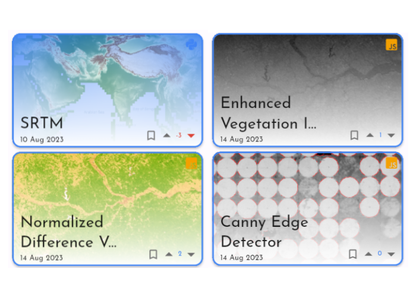

# 🌏 GeeLogic Application __*Thumbnail API*__ Documentation

Welcome to GeeLogic _Thumbnail_ API REST API. Each algorithm submitted by users on GeeLogic requires a screenshot of the map it renders to help visually distinguish one from another. This API generates such an image.

  

You can read about its endpoints in the following [Postman Documentation](https://documenter.getpostman.com/view/25451165/2s9YC1WtuM).
